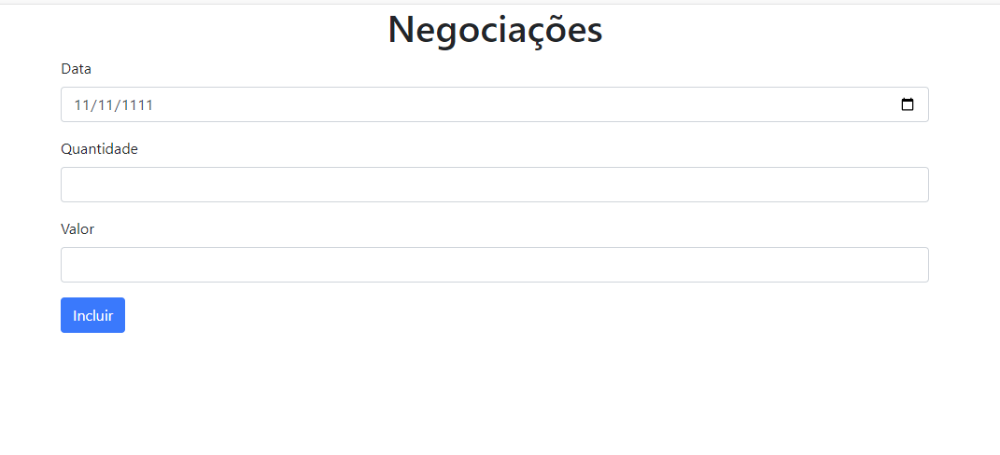

<h1 align="center"> <a href="https://cursos.alura.com.br/course/typescript-evoluindo-javascript" target="_blank">TypeScript parte 1: evoluindo seu JavaScript</a></h1>

Alura, escola de desenvolvedores 

  <a href="#-tecnologias">Tecnologias</a>&nbsp;&nbsp;&nbsp;|&nbsp;&nbsp;&nbsp;
  <a href="#-projeto">Projeto</a>&nbsp;&nbsp;&nbsp;|&nbsp;&nbsp;&nbsp;
  <a href="#-typescript">Typescript</a>&nbsp;&nbsp;&nbsp;|&nbsp;&nbsp;&nbsp;
  <a href="#memo-licença">Licença</a>&nbsp;&nbsp;&nbsp;|&nbsp;&nbsp;&nbsp;
  <a href="#-formulario-negociacao">Formulário-Negociação</a>

  

 

  

## 🚀 Tecnologias

Esse projeto foi desenvolvido com as seguintes tecnologias:

- TypeScript
- HTML
- Git e Github

## 💻 Descrição

* A negociação não pode ser modificada depois de criada.
* Obrigatoriamente tem uma data, quantidade e valor.
* Seu volume é calculado multiplicando-se a quantidade
negociada no dia pelo valor negociado 

## :memo: Licença

Esse projeto está sob a licença MIT.

---

 Feito com ♥ Alura :wave: [Acesse a comunidade!](https://www.alura.com.br/)
